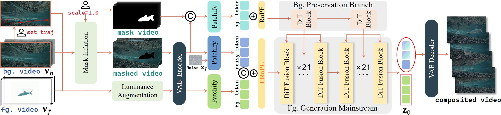

# GenCompositor

This repository contains the implementation of the paper "GenCompositor: Generative Video Compositing with Diffusion Transformer"

Keywords: Diffusion Models, Video Editing, Video Compositing

> [Shuzhou Yang](https://ysz2022.github.io/)<sup>1</sup>, [Xiaoyu Li](https://xiaoyu258.github.io/)<sup>2‡</sup>, [Xiaodong Cun](https://vinthony.github.io/)<sup>3</sup>, [Guangzhi Wang](http://gzwang.xyz/)<sup>2</sup>, [Lingen Li](https://lg-li.github.io/)<sup>4</sup>, [Ying Shan](https://www.linkedin.com/in/YingShanProfile/)<sup>2</sup>, [Jian Zhang](https://jianzhang.tech/)<sup>1✉</sup><br>
> <sup>1</sup>SECE, Peking University <sup>2</sup>ARC Lab, Tencent PCG <sup>3</sup>GVC Lab, Great Bay University <sup>4</sup>The Chinese University of Hong Kong <sup>‡</sup>Project Lead <sup>✉</sup>Corresponding Author


<p align="center">
<a href='https://gencompositor.github.io/'></a> &nbsp;
<a href="https://arxiv.org/abs/2509.02460"></a> &nbsp;
<a href="https://huggingface.co/TencentARC/GenCompositor"></a>
</p>


**📖 Table of Contents**


- [GenCompositor](#GenCompositor)
  - [🔥 Update Log](#-update-log)
  - [📌 TODO](#-todo)
  - [🛠️ Method Overview](#️-method-overview)
  - [🚀 Getting Started](#-getting-started)
    - [Environment Requirement 🌍](#-environment-requirement-)
    - [Checkpoints Download ⬇️](#-checkpoints-download-️)
  - [🏃🏼 Running Scripts](#-running-scripts)
    - [Gradio Demo 🤗](#-gradio-demo-)
    - [Inference 📜](#-inference-)
  - [🤝🏼 Cite Us](#-cite-us)
  - [💖 Acknowledgement](#-acknowledgement)
  - [📄 License](#-license)
  - [📬 Contact](#-contact)


## 🔥 Update Log

- [2025/9/2] 📢 📢  [GenCompositor](https://huggingface.co/TencentARC/GenCompositor) are released, the first generative video compositing framework with ERoPE for layout-unaligned video control.

## 📌 TODO

- [x] Release inference code
- [x] Release gradio demo
- [x] Release [GenCompositor checkpoints](https://huggingface.co/TencentARC/GenCompositor) (based on CogVideoX-5B)
- [ ] Release training code
- [ ] Dataset curation code
## 🛠️ Method Overview



Video compositing combines live-action footage to create video production, serving as a crucial technique in video creation and film production. 
Traditional pipelines require intensive labor efforts and expert collaboration, resulting in lengthy production cycles and high manpower costs. 
To address this issue, we automate this process with generative models, called generative video compositing. 
This new task strives to adaptively inject identity and motion information of foreground video to the target video in an interactive manner, allowing users to customize the size, motion trajectory, and other attributes of the dynamic elements added in final video. 
Specifically, we designed a novel Diffusion Transformer (DiT) pipeline based on its intrinsic properties. 
To maintain consistency of the target video before and after editing, we revised a light-weight DiT-based background preservation branch with masked token injection. 
As to inherit dynamic elements from other sources, a DiT fusion block is proposed using full self-attention, along with a simple yet effective foreground augmentation for training. 
Besides, for fusing background and foreground videos with different layouts based on user control, we developed a novel position embedding, named Extended Rotary Position Embedding (ERoPE). 
Finally, we curated a dataset comprising 61K sets of videos for our new task, called VideoComp. 
This data includes complete dynamic elements and high-quality target videos. Experiments demonstrate that our method effectively realizes generative video compositing, outperforming existing possible solutions in fidelity and consistency.


## 🚀 Getting Started

<details>
<summary><b>Environment Requirement 🌍</b></summary>

- CUDA 12.4
- PyTorch 2.5.0
- Python 3.10.16

Clone the repo:

```
git clone https://github.com/TencentARC/GenCompositor.git
```

We recommend you first use `conda` to create virtual environment, and install needed libraries. For example:


```
conda create -n gencompositor python=3.10 -y
conda activate gencompositor
pip install -r requirements.txt
```

Then, you can install diffusers (implemented in this repo) with:

```
cd ./diffusers
pip install -e .
```

After that, you can install required ffmpeg thourgh:

```
conda install -c conda-forge ffmpeg -y
```

</details>

<details>
<summary><b>Checkpoints Download ⬇️</b></summary>

Checkpoints of GenCompositor can be downloaded from [here](https://huggingface.co/TencentARC/GenCompositor). The ckpts folder contains 

- GenCompositor pretrained checkpoints for CogVideoX-5b-I2V
- pretrinaed CogVideoX-5b-I2V checkpoint from [HuggingFace](https://huggingface.co/THUDM/CogVideoX-5b-I2V). 

You can download the checkpoints, and put the checkpoints to the `ckpts` folder by:
```
git lfs install
git clone https://huggingface.co/TencentARC/GenCompositor
mv GenCompositor ckpts
```

You also need to download the base model [CogVideoX-5B-I2V](https://huggingface.co/THUDM/CogVideoX-5b-I2V) by:
```
git lfs install
cd ckpts
git clone https://huggingface.co/THUDM/CogVideoX-5b-I2V
```

Finally, you need to download checkpoints of [sam2](https://github.com/IDEA-Research/Grounded-SAM-2) for foreground segmentation:

```
cd ckpts
wget -c https://dl.fbaipublicfiles.com/segment_anything_2/092824/sam2.1_hiera_large.pt
```

The checkpoints structure should be like:

```
|-- ckpts
    |-- branch
        |-- config.json
        |-- diffusion_pytorch_model.safetensors
    |-- CogVideoX-5b-I2V
        |-- scheduler
        |-- transformer
        |-- vae
        |-- ...
    |-- model
        |-- pytorch_model
        |-- transformer
        |-- latest
        |-- random_states_0.pkl
        |-- random_states_1.pkl
        |-- random_states_2.pkl
        |-- random_states_3.pkl
        |-- scheduler.bin
        |-- zero_to_fp32.py
    |-- sam2.1_hiera_large.pt
```
</details>

## 🏃🏼 Running Scripts
<details>
<summary><b>Gradio Demo 🤗</b></summary>

You can easily utlize our model through gradio demo:

```
cd app
CUDA_VISIBLE_DEVICES=0 python app.py
```

Open your browser at http://localhost:7860

</details>

<details>
<summary><b>Inference 📜</b></summary>

Alternatively, you can also inference with the script:

```
cd infer

# Adjust the resolution, frame number of both background and foreground videos to the default value, and specify foreground element to be injected.
bash preprocess_bg_fg_videos.sh

# Drag trajectory (We recommend to perform this interactive step on your local host❗️)
##(1)In the pop-up window, hold down the left mouse button and drag to specify the movement trajectory. (2)Press the "ESC" key to exit and automatically output final binary mask video.
python get_movemask.py --rescale 1.0 --fg_video_path "../assets/fg/element/44867.mp4" --video_path "../assets/bg/source/511307.mp4" --file_path "../assets/usr_mask/511307_traj.txt" --usr_mask_path "../assets/usr_mask/511307_traj.mp4"

# Video compositing (GenCompositor starts work❗️)
python testinput.py --fg_video_path "../assets/fg/element/44867.mp4" --video_path "../assets/bg/source/511307.mp4" --mask_path "../assets/usr_mask/511307_traj.mp4" --output_path "./output.mp4" --num_inference_steps 50
```

</details>


## 🤝🏼 Cite Us

```
@article{GenCompositor,
  title={GenCompositor: Generative Video Compositing with Diffusion Transformer},
  author={Shuzhou Yang and Xiaoyu Li and Xiaodong Cun and Guangzhi Wang and Lingen Li and Ying Shan and Jian Zhang},
  journal={arXiv preprint arXiv:2509.02460},
  year={2025}
}
```


## 💖 Acknowledgement
<span id="acknowledgement"></span>

Our code is modified based on [diffusers](https://github.com/huggingface/diffusers) and [CogVideoX](https://github.com/THUDM/CogVideo), thanks to all the contributors!

## 📄 License

We are pleased to support the open source community. For complete license details, see [LICENSE](LICENSE) and [NOTICE](NOTICE). 

## 📬 Contact

For any questions, feel free to [email](mailto:szyang@stu.pku.edu.cn).


## 🌟 Star History

<p align="center">
    <a href="https://star-history.com/#TencentARC/GenCompositor" target="_blank">
        
    </a>
</p>
